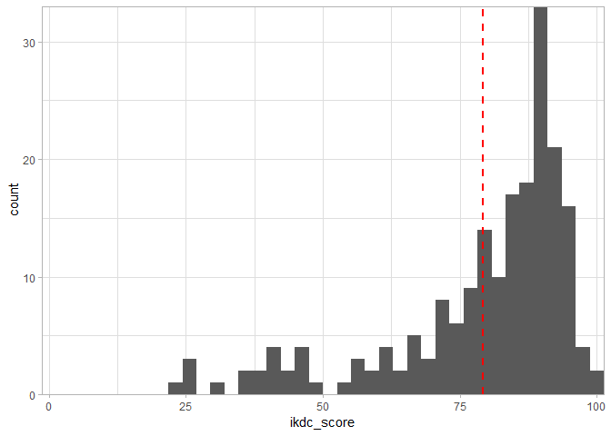

IKDC Questionnaire Scoring
================

This document provides an example of the IKDC questionnaire scoring process. The IKDC is a patient-reported measure of knee-specific symptoms, function, and sports activity. Scores range from 0 to 100, with higher scores indicating higher levels of function.

``` r
library(readr)
library(dplyr)

data <- read_csv("ikdc_example_sml.csv")
```

``` r
head(data)
```

    ## # A tibble: 6 x 19
    ##      ID PERF   PAIN  SEV   STIFF  SWELL  LOCK  GIVE   PARTIC UPSTRS DNSTRS
    ##   <int> <chr>  <chr> <chr> <chr>  <chr>  <chr> <chr>  <chr>  <chr>  <chr> 
    ## 1   100 moder~ three five  mildly stren~ no    stren~ moder~ not d~ not d~
    ## 2   101 stren~ two   three mildly stren~ no    stren~ stren~ not d~ minim~
    ## 3   102 very ~ zero  zero  not a~ very ~ no    very ~ very ~ not d~ not d~
    ## 4   103 very ~ one   one   mildly moder~ yes   very ~ stren~ not d~ minim~
    ## 5   104 very ~ zero  one   not a~ stren~ no    very ~ stren~ not d~ not d~
    ## 6   105 moder~ four  two   mildly very ~ yes   stren~ moder~ not d~ not d~
    ## # ... with 8 more variables: KNEEL <chr>, SQUAT <chr>, SIT <chr>,
    ## #   RISE <chr>, RUN <chr>, JUMP <chr>, STOP <chr>, CRFUNC <chr>

In this example, the responses are stored as text strings. The responses need to be converted from text to item-level scores. Some items have equivalent scoring - we'll create functions to score those items.

``` r
# Recode item response: "unable to do" = 0 / "not difficult at all" = 4 
ik_unable_0<- function(var) {
  res <- recode(var, 
                "unable to do" = 0, "extremely difficult" = 1,
                "moderately difficult" = 2, "minimally difficult" = 3,
                "not difficult at all" = 4,
                .default = 999, .missing = NA_real_)
}

# Recode item response: "zero" = 10 / "ten" = 0
ik_numeric_rev <- function(var) {
  res <- recode(var, 
                "zero" = 10, "one" = 9, "two" = 8, "three" = 7,
                "four" = 6, "five" = 5, "six" = 4, "seven" = 3,
                "eight" = 2, "nine" = 1, "ten" = 0,
                .default = 999, .missing = NA_real_)
}
```

The following scoring functions are only used once (and thus aren't necessary to create - but it's nice to have all the recoding information in one place).

``` r
ik_crfunc <- function(var) { 
  res <- recode(var, 
                "zero" = 0, "one" = 1, "two" = 2, "three" = 3,
                "four" = 4, "five" = 5, "six" = 6, "seven" = 7,
                "eight" = 8, "nine" = 9, "ten" = 10,
                .default = 999, .missing = NA_real_)
}
ik_perf <- function(var){
  res <- recode(var,
                "unable to perform any of the above activities due to knee pain" = 0,
                "light activities like walking, housework, or yard work" = 1,
                "moderate activities like moderate physical work, running or jogging" = 2,
                "strenuous activities like heavy physical work, skiing or tennis" = 3,
                "very strenuous activities like jumping or pivoting as in basketball or soccer" = 4,
                .default = 999, .missing = NA_real_)
}
ik_stiff <- function(var){
  res  <-  recode(var,
                  "not at all" = 4, "mildly" = 3,
                  "moderately" = 2, "very" = 1,
                  "extremely" = 0,
                  .default = 999, .missing = NA_real_)
}
ik_swell <- function(var){
  res <- recode(var, 
                "very strenuous activities like jumping or pivoting as in basketball or soccer" = 4,
                "strenuous activities like heavy physical work, skiing or tennis" = 3,
                "moderate activities like moderate physical work, running or jogging" = 2,
                "light activities like walking, housework, or yard work" = 1,
                "unable to perform any of the above activities due to knee swelling" = 0,
                .default = 999, .missing = NA_real_)
}
ik_lock <- function(var){
  res <-  recode(var, 
                 "no" = 1, "yes" = 0,
                 .default = 999, .missing = NA_real_)
}
ik_give <- function(var){
  res <- recode(var,
                  "unable to perform any of the above activities due to giving way of the knee" = 0,
                  "light activities like walking, housework, or yard work" = 1,
                  "moderate activities like moderate physical work, running or jogging" = 2,
                  "strenuous activities like heavy physical work, skiing or tennis" = 3,
                  "very strenuous activities like jumping or pivoting as in basketball or soccer" = 4,
                  .default = 999, .missing = NA_real_)
}
ik_partic <- function(var){
  res <- recode(var,
                  "unable to perform any of the above activities due to knee" = 0,
                  "light activities like walking, housework, or yard work" = 1,
                  "moderate activities like moderate physical work, running or jogging" = 2,
                  "strenuous activities like heavy physical work, skiing or tennis" = 3,
                  "very strenuous activities like jumping or pivoting as in basketball or soccer" = 4,
                  .default = 999, .missing = NA_real_)
}
```

Now that all of the functions have been created, we can use them to recode the text responses into item-level scores.

``` r
scores <- data %>% 
  mutate_at(vars(PAIN, SEV), ik_numeric_rev) %>% 
  mutate_at(vars(UPSTRS, DNSTRS, KNEEL, SQUAT, 
                 SIT, RISE, RUN, JUMP, STOP), ik_unable_0) %>% 
  mutate(
    CRFUNC = ik_crfunc(CRFUNC),
    PERF   = ik_perf(PERF),
    STIFF  = ik_stiff(STIFF),
    SWELL  = ik_swell(SWELL),
    LOCK   = ik_lock(LOCK),
    GIVE   = ik_give(GIVE),
    PARTIC = ik_partic(PARTIC)
  )
```

The IKDC can only be scored if participants repond to 16 items or more. We'll record a count of the number of non-missing responses to be used later.

``` r
count_exist <- function(x) sum(!is.na(x))

scores  <- scores %>% mutate(response_count = apply(., 1, count_exist))
```

The IKDC score is calculated by: \[sum of the item level scores\] / \[sum of the maximum scores possible on the items to which the participants responded\] \* 100.

IKDC items have maximum scores of either 1, 4, or 10. In preparation of calculating the denominator value, we'll create a version of each IKDC item that contains either: NA (if the participant did not respond) or the maximum possible value (if the participant did respond). These variables will have the same names as the item-level score variables, but with a "\_denom" suffix.

``` r
scores <- scores %>% 
  mutate(LOCK_denom = ifelse(is.na(LOCK), NA, 1)) %>% 
  mutate_at(vars(PERF,STIFF,SWELL,GIVE,PARTIC,UPSTRS,
                 DNSTRS,KNEEL,SQUAT,SIT,RISE,RUN,JUMP,STOP),
            .funs = funs(denom = ifelse(is.na(.), NA, 4))) %>% 
  mutate_at(vars(PAIN,SEV, CRFUNC),
            .funs = funs(denom = ifelse(is.na(.), NA, 10)))
```

Now we can calculate the IKDC score. The numerator is created by summing the item-level scores. The denominator is created by summing the maximum scores for non-missing items.

``` r
scores <- scores %>% 
  mutate(
    numerator = scores %>% select(PERF:CRFUNC) %>% rowwise() %>% rowSums(na.rm=TRUE),
    denominator = scores %>% select(ends_with("denom")) %>% rowwise() %>% rowSums(na.rm=TRUE),
    ikdc_score = ifelse(response_count > 15, (numerator/denominator)*100, NA)
  )
```

The scores can be merged back into the original dataset.

``` r
data <- data %>% left_join(scores %>% select(ID, ikdc_score), by="ID")
```

IKDC scores range from 0 to 100. Let's look at a summary:

``` r
data %>% summarize(
  min = min(ikdc_score, na.rm=TRUE),
  mean = mean(ikdc_score, na.rm=TRUE),
  max = max(ikdc_score, na.rm=TRUE),
  missing = sum(is.na(ikdc_score))
  )
```

    ## # A tibble: 1 x 4
    ##     min  mean   max missing
    ##   <dbl> <dbl> <dbl>   <int>
    ## 1  23.0  79.1  100.       1

We can also easily see the score's distribution.

``` r
library(ggplot2)
theme_set(theme_light())

data %>% 
  filter(!is.na(ikdc_score)) %>% 
  ggplot(aes(ikdc_score))+
  geom_histogram(bins=40) +
  expand_limits(x = 0, y = 0) +
  scale_y_continuous(expand = c(0,0)) +
  scale_x_continuous(expand = c(0,0)) +
  geom_vline(aes(xintercept=mean(ikdc_score)), 
             color="red", linetype="dashed", size=1)
```


